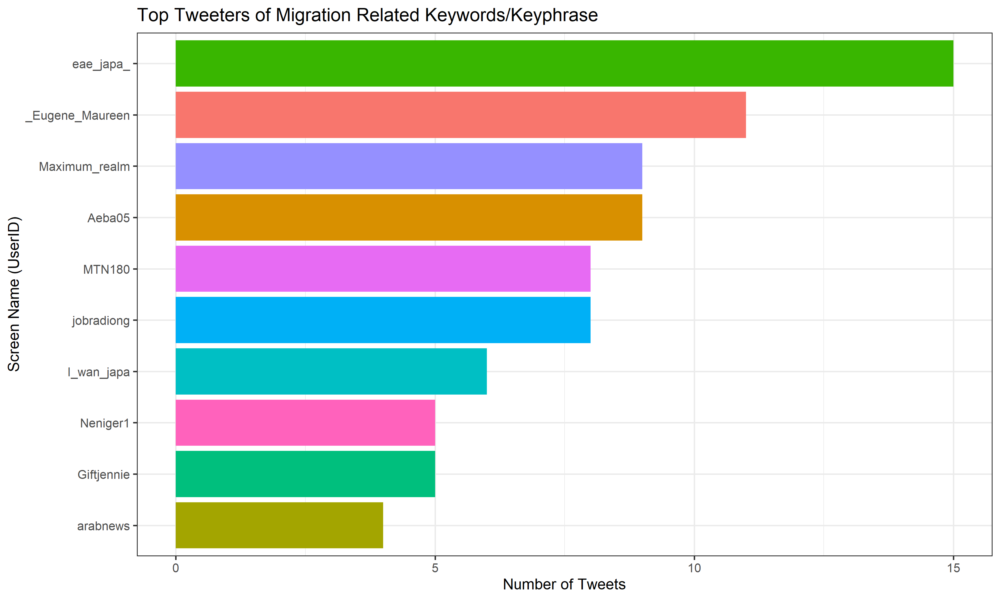

## Working with Digital Trace Data and ethics - Twitter with rtweet and Facebook

[Howison et al. 2011](https://doi.org/10.17705/1jais.00282){:target="_blank"} describes digital traces as "records of activity (trace data) undertaken through an online information system (digital)." In other words, digital traces are information about individuals or groups that can be retrieved via online information systems. Such information systems could include social media sites (Facebook, Twitter, TikTok), web search data (Google search trends), blogs/other internet forums (Reddit, Quora), administrative data on websites (WorldBank, Wikipedia) and several others. These data sources have presented a wide range of opportunities to answer new and exciting demographic/social science research questions *(see below for a relevant example)*. This session will focus on using data from one of the information systems - Twitter (social media).


## Objective

This is an applied session, leveraging the skills you have learned from the previous days to analyzing unstructured text data from Twitter. Precisely, by the end of this session, you should be able to:

-   apply your data wrangling/analysis skills to text data retrieved from Twitter

-   conduct basic analysis of texts from Twitter.

-   visualize patterns and relationships in Twitter data.

-   formulate interesting research questions answerable using data from Twitter.

## Twitter Data Retrieval

As mentioned previously, we can obtain a record of individual's activity from digital platforms to make inferences about their attitudes, knowledge and/or behaviour. Twitter is an exciting source of data on social attitudes because it facilitates discussions about a wide range of social and personal issues. As you may have observed from the pre-lecture readings, data obtained from Twitter can be used to understand loneliness, suicide ideation, perception about COVID19/gender-based violence/police brutality. The screenshot below highlights the kind and amount of information available from a single tweet by an individual.


We will use the `rtweet` package to retrieve similar tweets but directly into Rstudio for further analysis in today's session. We will analyze tweets related to pregnancy during COVID19, migration, and politics. We will approach the analysis differently: using a set of keywords or using an influencer-based approach. We will examine the patterns of the tweets, the context of the tweets using *ngrams* and visualize the sentiments of tweets. As indicated in the [pre-lecture instructions](https://github.com/eolamijuwon/IEMeSSR/blob/main/Lectures/README.md#day-3-wednesday-may-12-2021), please install the relevant packages before you proceed to load the libraries.

``` {.r}
#install.packages("rtweet")
library (rtweet)
library (tidyverse)
library (mosaic)
library (tidytext)
library (tweetrmd)
library (lubridate)
```

In order to be able to stream tweets directly from Twitter, you need to have created a Twitter account. If you do not have one, please click [here](https://twitter.com/). Previously, you would be required to create a Developer App to access data from Twitter. You could still do that if you want. However, note that `rtweet` should be used strictly following Twitter's [developer terms](https://developer.twitter.com/en/developer-terms/more-on-restricted-use-cases).

In the following few lines of code, we retrieve public tweets related to pregnancy during the pandemic. Reference to "during the pandemic" because we are in the middle of a pandemic - although much better in some regions now than before. To retrieve the tweets, we will use the `rtweet` package to download tweets within the past eight days, including all keywords related to pregnancy, e.g., pregnant, pregnancy, expecting a baby e.t.c.

``` {.r}
pregnant_keywd <- search_tweets(q = "pregnancy",
                                geocode = "-2.791166,12.094754,2258mi",
                                include_rts = FALSE, n = 5000,
                                retryonratelimit = TRUE)
```

See below for a relevant tweet matching our keyword of interest.


We can also retrieve tweets that follow a keyphrase pattern like "expecting a baby" or "baby bump".

``` {.r}
pregnant_keyphrase <-   search_tweets(q = "\"expecting a baby\"",
                                      ## The geocode argument is specified to 
                                      ## retain only tweets from Africa.
                                      ## Note that there's no space after the commas.
                                      geocode = "-2.791166,12.094754,2258mi",
                                      include_rts = FALSE,
                                      n = 5000,
                                      ## The retryonratelimit argument instructs 
                                      ## R to retry downloading the tweets after some 
                                      ## mins once the rate limit has been reached
                                      retryonratelimit = TRUE)
```


We now have two different datasets with tweets related to pregnancy. We could have searched for these in one query or merge the two datasets into one as `merged_pregDF`.

``` {.r}
merged_pregDF <- rbind(pregnant_keywd,
                        pregnant_keyphrase)
```

Now that we have a single dataset with all the information we need, we can write the data to disk as *.csv* on your local computer using the `save_as_csv` function or as a single R object using `saveRDS.` This is very important mainly because we are working with online data that is available only for some time.

``` {.r}
save_as_csv(merged_pregDF, "../data/merged_pregDF.csv",
            prepend_ids = TRUE, na = "NA")
            
saveRDS(merged_pregDF, "../data/merged_pregDF.rds")
```

There's more that you can with `rtweet` for example, you can:

-   search for users with the keyword "demography" on their profile:

    ``` {.r}
    usrs_demo <- search_users("demography", n = 1000) 
    ```

        ## # A tibble: 15 x 4
        ##    screen_name   description                       followers_count friends_count
        ##    <chr>         <chr>                                       <int>         <int>
        ##  1 DrDemography  "Demographer | Demography, popul~            8973          1896
        ##  2 nia_demograp~ "NIA Coordinating Center for the~            1259           741
        ##  3 ncdemography  "Based at the Carolina Populatio~            2660           197
        ##  4 UoSSocStatDe~ "Social Statistics and Demograph~            1037           236
        ##  5 TexasDemogra~ "The Texas Demographic Center fu~            1279           368
        ##  6 AppDemography "\U0001f1f5\U0001f1f7 Asst Prof ~            6025          4974
        ##  7 Demography_A~ "The ANU School of Demography is~             865           266
        ##  8 WiCVienna     "The Wittgenstein Centre for Dem~            3160           429
        ##  9 SDA_Demograp~ "Professional org of #demographe~            1584           620
        ## 10 DemographyOz  "Data scientist, Chief Demograph~             894          1988
        ## 11 ConDemography "Asst Professor in the @SanfordS~             587           577
        ## 12 ID_VUB        "Demographic research centre at ~             504           849
        ## 13 hfedlab       ""                                            230           171
        ## 14 WitsDemograp~ "Interdisciplinary demographic t~             441           144
        ## 15 GEDA_IMEDEA   ""                                            589           445

-   search for users who follow a person/celebrity/popular personality:

    ``` {.r}
    follow_eo <- get_followers("eolamijuwon", n = 10000)
    ```

-   get the most recent tweets from a person/celebrity/popular personality:

    ``` {.r}
    tmls_iemessr <- get_timelines(c("WitsDemography", "eolamijuwon",
                                    "yemiadewoyin", "BlessingManB",
                                    "CliffOdimegwu"), n = 1000)
    ```

        ## # A tibble: 10 x 5
        ##    screen_name  text                     is_retweet favorite_count retweet_count
        ##    <chr>        <chr>                    <lgl>               <int>         <int>
        ##  1 WitsDemogra~ "An exciting new discov~ TRUE                    0            18
        ##  2 WitsDemogra~ "\U0001f4da<U+270D><U+FE0F>\U0001f3fe<U+270D><U+FE0F>~ TRUE                    0            79
        ##  3 WitsDemogra~ "Professor @MarkCollins~ TRUE                    0             2
        ##  4 WitsDemogra~ "This afternoon: Profes~ TRUE                    0             9
        ##  5 WitsDemogra~ "Our colleagues @SashFB~ TRUE                    0             3
        ##  6 WitsDemogra~ ".@TC_Africa just relea~ TRUE                    0             7
        ##  7 WitsDemogra~ "@SashaFB @ACMSWits @jo~ FALSE                   0             0
        ##  8 WitsDemogra~ "Fantastic all women pa~ TRUE                    0             6
        ##  9 WitsDemogra~ "Wonderful to be @ACMSW~ TRUE                    0             4
        ## 10 WitsDemogra~ "RSVP to Join us at the~ FALSE                  10             3

Other relevant functions are `get_friends()`, `get_mentions()` among others.

## Activity I - Migration

As an activity, we will analyze how migration is discussed on Twitter. To do this, we need to identify a set of keywords that people are likely to include in their discussions about migration on Twitter. Below, I have listed a few. Feel free to add as many that you deem relevant.

``` {.r}
keywords <- c("\"travel abroad\"",
              "\"relocate abroad\"",
              "\"study abroad\"", 
              "\"work abroad\"", 
              "\"leave the country\"",
              "\"leave this country\"",
              "\"study visa\"", "\"work visa\"", 
              "migrate", "japa")
```

``` {.r}
migration_tweets <- Map("search_tweets", n=20000, keywords,
                        geocode = "-2.791166,12.094754,2258mi",
                        include_rts = FALSE, retryonratelimit = TRUE)


## Convert your downloaded tweets to data.frame()
## data.frame() = data with rows and columns
DFmigration_tweets <-  do_call_rbind(migration_tweets)

## Save data as an R object
saveRDS(DFmigration_tweets, "../data/DFmigration_tweets.rds")
```

``` {.r}
DFmigration_tweets <- readRDS("../data/DFmigration_tweets.rds")
```

<blockquote class="twitter-tweet" data-width="550" data-lang="en" data-dnt="true" data-theme="light">

<p lang="en" dir="ltr">

You dey travel abroad and you dey pack your power bank<br><br>What for ?????

</p>

--- kul me henry 🌎🌏🗺 (@henryhustler001) <a href="https://twitter.com/henryhustler001/status/1390985971445940228?ref_src=twsrc%5Etfw">May 8, 2021</a>

</blockquote>

<blockquote class="twitter-tweet" data-width="550" data-lang="en" data-dnt="true" data-theme="light">

<p lang="en" dir="ltr">

This is why almost everyone is going into entertainment, the ones who can't travel abroad or go into fraud while the rest of us continue to manage the 15k

</p>

--- ONKU SOLA💧 (@_desolz) <a href="https://twitter.com/_desolz/status/1390987703836192770?ref_src=twsrc%5Etfw">May 8, 2021</a>

</blockquote>

<blockquote class="twitter-tweet" data-width="550" data-lang="en" data-dnt="true" data-theme="light">

<p lang="en" dir="ltr">

Yes of course, they work hard to earn living, they never engage in child trafficking, they aren't drug pushers, never travel abroad for prostitution neither yahoo boys. They govern the country. vis-à-vis we remain grateful and hatred will take you to grave deadbeat.

</p>

--- Bldr. Nura Adam (ALMALIKI ) 🏗️🌉 (@RealDanAttah) <a href="https://twitter.com/RealDanAttah/status/1390670401307611142?ref_src=twsrc%5Etfw">May 7, 2021</a>

</blockquote>

<blockquote class="twitter-tweet" data-width="550" data-lang="en" data-dnt="true" data-theme="light">

<p lang="en" dir="ltr">

The more the Government fails us the crime rate gets worse.<br>We're in literal hell!💔<br>Lapho bona they'll just pack their things and children and leave the country.<br>Eyi😔

</p>

--- I am Baby (@uzotha_m) <a href="https://twitter.com/uzotha_m/status/1389814822183768068?ref_src=twsrc%5Etfw">May 5, 2021</a>

</blockquote>

### Top Tweeters

We might be interested in finding the most popular voices about an issue. By popular, I mean those who tweet most frequently about the topic of interest, but they may not necessarily have the largest following on Twitter. This analysis may be necessary for a few reasons. We might be interested in the most popular voices on COVID information, and having identified those profiles, we can download their timelines to understand the kind of things they post and the veracity of their updates. Our analysis might show that some of them only propagate misleading information about COVID19 while others tweet accurate information about COVID19 management, treatment and vaccination. From our awareness of the accuracy of their tweets, we might also be interested in knowing those who follow accounts that consistently propagate fake news and see if they follow the same pattern as the "influencer".

``` {.r}
topTweets   <-  DFmigration_tweets %>%
                arrange(screen_name) %>%  
                group_by(screen_name) %>% 
                summarize(n = n()) %>% 
                arrange(desc(n))
```

In the above analysis, we took our `DFmigration_tweets` dataset, sort the columns by screen_name/username, then grouped by user and counted the number of tweets per user. This is a basic approach and assumes that each tweet has a meaningful contribution to the topic. Subsequently, we could visualize the distribution using the `ggplot` function and specify columns for the x-axis and y-axis. In addition, it is also important to label the axis so that it is easy to understand what is plotted where.

``` {.r}
head(topTweets, 10) %>% 
ggplot(aes(x = n, y = reorder(screen_name, n), fill = screen_name)) +
geom_col() + labs(x = "Number of Tweets",
                  y = "Screen Name (UserID)",
                  title = "Top Tweeters of Migration Related Keywords/Keyphrase") +
theme_bw() + theme(legend.position = "none")
```

``` {.r}
ggsave(file="../Images/top_tweeters.png", dpi=350, height= 6, width= 10)
```



### Socioeconomics - Ownership of Assets

Socioeconomic characteristics provide valuable insights into understanding socioeconomic inequalities. It might be essential to understand which voices dominate a discussion. There is a widespread belief that the type of device owned may serve as a rudimentary marker of the level of wealth. Ownership of an iPhone, for example, is [reported](https://www.mirror.co.uk/tech/you-iphone-youre-rich-according-12886757) to be correlated with affluence.

Ownership of a laptop may also reflect affluence since this is likely combined with another smartphone. As a result, we could use this information as an indication of wealth where available. Twitter, for example, logs the device from which a tweet has been posted, such as *Twitter for Android*, *Twitter for iPhone*, *Twitter for iPad*, *Twitter Web App* among several others.

Similar to the previous activity, in the next few lines of code, we will retrieve the `DFmigration_tweets` dataset, sort the columns by screen_name/username, then retained a distinct row for each user, grouped by source/device type and counted the number of tweets per device type. This is also a basic approach and assumes that each user only tweets from one type of device, which may not be very accurate in reality. Subsequently, we visualize the distribution using the `ggplot` function and specify columns for the x-axis and y-axis. In addition, it is also important to label the axis so that it is easy to understand what is plotted where.

``` {.r}
asset_own <-  DFmigration_tweets %>%
              arrange(screen_name) %>%  
              distinct(screen_name, .keep_all = TRUE) %>% 
              group_by (source) %>% 
              summarize (n = n()) %>% 
              arrange (desc(n)) %>% 
              mutate (perc = ((n/sum(n))*100) %>% round(2))
```

``` {.r}
head(asset_own, 5) %>% 
ggplot(aes(x = perc, y = reorder(source, perc),
           fill = source)) +
geom_col() + labs(x = "Percentage of Tweets (%)",
                  y = "Device Type",
                  title = "Top Tweeters of Migration Related Keywords/Keyphrase") +
theme_bw() + theme(legend.position = "none")
```

``` {.r}
ggsave(file="../Images/top_devices.png", dpi=350, height= 4.5, width= 10)
```


### Tweet Contents

Thus far, we have attempted to characterize the tweets using information about the tweet's metadata $$characteristics of tweets$$, not the content of the tweets themselves. However, we could also examine the contents of the tweets, focusing on how a topic is discussed. We could do this in several ways - grouping tweets into topic areas, analyzing sentiments, or the most frequent word combinations (ngrams) in the tweets.

In the following lines of code, we will use the same `DFmigration_tweets` dataset and break the chunk of tweets into three words. Subsequently, we will examine each word and remove words that follow a pattern such as stopwords (commonly used words like the, he, have), numeric digits, punctuation, words with three or more repeated letters (ahhh), any single letter, or repeated words. We will then combine all other remaining words to make sense of the most frequent three-word combinations in the dataset.

``` {.r}
text_migration <-   DFmigration_tweets %>% 
                    select(status_id, text, screen_name) %>% 
                    unnest_tokens(trigram, text, token = "ngrams", n = 3) %>% 
                    separate(trigram, c("word1", "word2", "word3"), sep = " ") %>%  
                    
                    ## Remove common words (stopwords).
                    filter(!word1 %in% stop_words$word,       # remove stopwords 
                            !word2 %in% stop_words$word,       # remove stopwords
                            !word3 %in% stop_words$word) %>% 
                            
                           # removes any words with numeric digits
                    filter(!str_detect(word1, pattern = "[[:digit:]]"),
                            !str_detect(word2, pattern = "[[:digit:]]"),
                            !str_detect(word3, pattern = "[[:digit:]]"),
                            
                            # removes any remaining punctuation
                            !str_detect(word1, pattern = "[[:punct:]]"),
                            !str_detect(word2, pattern = "[[:punct:]]"),
                            !str_detect(word3, pattern = "[[:punct:]]"),
                            
                            # removes any words with 3 or more repeated letters
                            !str_detect(word1, pattern = "(.)\\1{3,}"),
                            !str_detect(word2, pattern = "(.)\\1{3,}"),
                            !str_detect(word3, pattern = "(.)\\1{3,}"),
                           
                            !str_detect(word1, pattern = "affidua"),
                            !str_detect(word1, pattern = "affiuduaeasystudy"),
                            
                           
                            # removes any remaining single letter words
                            !str_detect(word1, pattern = "\\b(.)\\b"), 
                            word1 != word2,
                            word2 != word3) %>% 

                       unite("trigram", c(word1, word2, word3), sep = " ") %>%
                       count(trigram, sort = TRUE)
```

``` {.r}
head(text_migration, 10)
```

    ## # A tibble: 10 x 2
    ##    trigram                           n
    ##    <chr>                         <int>
    ##  1 study abroad uk                  11
    ##  2 agency debrend travels            9
    ##  3 traveling agency debrend          9
    ##  4 trusted traveling agency          9
    ##  5 abroad invite students            8
    ##  6 easy study abroad                 8
    ##  7 partner universities abroad       8
    ##  8 program tuition fee               8
    ##  9 study abroad invite               8
    ## 10 undergraduate program tuition     8

## Activity II - Politics/Governance

### Sentiment Analysis

Sentiment analysis is a contextual mining technique used to identify, interpret, and classify emotions (positive, negative or neutral) within a corpus of text data or voice. Sentiment analysis provides an opportunity to evaluate perceptions about a prevalent social issue, problem or online conversation. For example, we could be interested in the sentiments of tweets on the US immigration ban. Using cross-correlation analysis of Donald Trump's Twitter feed, [one study](https://doi.org/10.1109/CCWC47524.2020.9031237) found a preliminary "causative relationship between POTUS Twitter activity and approval rating". Another [study](https://doi.org/10.1109/CEC.2017.7969455) used hashtags to collect Twitter posts from different companies and showed that it was possible to predict stock market fluctuations using public mood collected from Twitter.

In the following activity, we will retrieve Twitter feeds from the presidents of selected African countries using the `get_timelines` function. The aim will be to examine trends in their Twitter activity from July 2019 (pre-COVID) to December 2020 (during COVID).

``` {.r}
tmls_politics <- get_timelines(c("MBuhari",  #President of the Republic of Nigeria
                                "CyrilRamaphosa",  #President of the Republic of South Africa 
                                "NAkufoAddo", #President of Ghana
                                "EdgarCLungu" #President of Zambia
                                ), n = 20000)

## Save data as an R object
saveRDS(tmls_politics, "../data/PoliticsTimeline_tweets.rds")
```

``` {.r}
tmls_politics <- readRDS("../data/PoliticsTimeline_tweets.rds")
```

<blockquote class="twitter-tweet" data-width="550" data-lang="en" data-dnt="true" data-theme="light">

<p lang="en" dir="ltr">

I am pleased with the success we are recording in the enrollment of persons into the National Identification Number (NIN) database. 54 million Nigerians have now enrolled; I am told over 12 million of these within the last six months. Our goal is total coverage.

</p>

--- Muhammadu Buhari (@MBuhari) <a href="https://twitter.com/MBuhari/status/1390308960830332939?ref_src=twsrc%5Etfw">May 6, 2021</a>

</blockquote>

<blockquote class="twitter-tweet" data-width="550" data-lang="en" data-dnt="true" data-theme="light">

<p lang="en" dir="ltr">

The sustainability of our economic growth and development depends to a great extent on the development of the entire Southern African region.<br> <a href="https://twitter.com/hashtag/SONAReply?src=hash&amp;ref_src=twsrc%5Etfw">\#SONAReply</a> <a href="https://t.co/bmQ1sX0SQc">https://t.co/bmQ1sX0SQc</a>

</p>

--- Cyril Ramaphosa 🇿🇦 \#StaySafe (@CyrilRamaphosa) <a href="https://twitter.com/CyrilRamaphosa/status/1362383668640112642?ref_src=twsrc%5Etfw">February 18, 2021</a>

</blockquote>

<blockquote class="twitter-tweet" data-width="550" data-lang="en" data-dnt="true" data-theme="light">

<p lang="en" dir="ltr">

I wish Muslims in Ghana and around the world <a href="https://twitter.com/hashtag/EidMubarak?src=hash&amp;ref_src=twsrc%5Etfw">\#EidMubarak</a>. <a href="https://t.co/KjAEjsUc76">pic.twitter.com/KjAEjsUc76</a>

</p>

--- Nana Akufo-Addo (@NAkufoAddo) <a href="https://twitter.com/NAkufoAddo/status/879356470227349505?ref_src=twsrc%5Etfw">June 26, 2017</a>

</blockquote>

<blockquote class="twitter-tweet" data-width="550" data-lang="en" data-dnt="true" data-theme="light">

<p lang="en" dir="ltr">

No greater gift a parent can give his child than education. I have worked to ensure conducive environment for them. <a href="https://t.co/106d0d6BlQ">pic.twitter.com/106d0d6BlQ</a>

</p>

--- Edgar Chagwa Lungu (@EdgarCLungu) <a href="https://twitter.com/EdgarCLungu/status/743308095879688192?ref_src=twsrc%5Etfw">June 16, 2016</a>

</blockquote>

``` {.r}
sentiment_mig    <-  tmls_politics %>%
                     select(created_at, text, 
                            favorite_count, 
                            retweet_count, screen_name) %>%
                     unnest_tokens("word", text) %>%
                     
                     ## Filter for words that are not in the stopwords dictionary
                     anti_join(stop_words, by = "word") %>%
                     
                     ## Filter for words that are in the sentiment dictionary and our dataframe
                     inner_join(y = sentiments, by = "word") %>% 
                     ## Count the number sentiments used each day
                     mutate(date = format(as.Date(created_at), "%b %Y")) %>% 
                     mutate(year = created_at %>% year(),
                            month = created_at %>% month()) %>% 
                     filter (created_at >= date("2019-08-01") & created_at <= date("2020-12-31")) %>% 
                     group_by (screen_name, year, month, date, sentiment) %>% 
                     count(screen_name, date, sentiment) %>% 
                     ungroup() %>% 
                     group_by(screen_name) %>% 
                     mutate (percentage = (n/sum(n))) %>% 
                     mutate (percentage = round (percentage, digits = 2)) %>% 
                     ungroup() %>% 
                     mutate (month = ifelse((year > 2019),
                                            12 + month,
                                            month)) %>% 
                     mutate (percentage = ifelse((sentiment == "positive"),
                                              percentage, -percentage))
```

``` {.r}
#   pivot_wider(id_cols = c(screen_name, month, date, sentiment, n),
#               values_from = percentage,
#               names_from = sentiment)
ggplot() +
  geom_line(data = sentiment_mig %>% filter (sentiment == "positive"),
            aes(x =  reorder(date,month),
                y = percentage,
                color = screen_name,
                group = screen_name),
            size = 1.1) +
  
  geom_point(data = sentiment_mig %>% filter (sentiment == "positive"),
            aes(x =  reorder(date,month),
                y = percentage,
                color = screen_name),
            size = 2.5) +
  
  geom_line(data = sentiment_mig %>% filter (sentiment == "negative"),
            aes(x =  reorder(date,month),
                y = percentage,
                color = screen_name,
                group = screen_name),
            size = 1.1) +
  
  geom_point(data = sentiment_mig %>% filter (sentiment == "negative"),
            aes(x =  reorder(date,month),
                y = percentage,
                color = screen_name),
            size = 2.5) +
  geom_segment(aes(x = 7, y = -0.12, xend = 7, yend = 0.3),
               color = "#a8a032", size = 1) +
  
  geom_segment(aes(x = 0, y = 0, xend = 18, yend = 0.0),
               color = "black", size = 1) +


  scale_y_continuous(breaks=seq(-0.12, 0.30, 0.03),
                     limits=c(-0.12, 0.30),
                     labels=scales::percent) +
  labs (y = "Percentage of Words over the period [Jan 2020 - May 2021]",
        x = "Month and Year",
        color = "Screen Name") +
  theme_light() + theme (legend.position = "bottom")
```

``` {.r}
ggsave(file="../Images/sentiments.png", dpi=350, height= 6, width= 10)
```


Below are a few tweets from the president of Ghana during the period.

<blockquote class="twitter-tweet" data-width="550" data-lang="en" data-dnt="true" data-theme="light">

<p lang="en" dir="ltr">

15 million residents in Ghana, both nationals and foreigners, can now be identified through a unique number under the National Identification Card scheme, implemented successfully under the NPP Government. <a href="https://twitter.com/hashtag/MakingGhanaEfficient?src=hash&amp;ref_src=twsrc%5Etfw">\#MakingGhanaEfficient</a> <a href="https://twitter.com/hashtag/4MoreForNana?src=hash&amp;ref_src=twsrc%5Etfw">\#4MoreForNana</a> <a href="https://t.co/F8wykhzjlf">pic.twitter.com/F8wykhzjlf</a>

</p>

--- Nana Akufo-Addo (@NAkufoAddo) <a href="https://twitter.com/NAkufoAddo/status/1318160157466107905?ref_src=twsrc%5Etfw">October 19, 2020</a>

</blockquote>

<blockquote class="twitter-tweet" data-width="550" data-lang="en" data-dnt="true" data-theme="light">

<p lang="en" dir="ltr">

334,084 households have benefitted from the Livelihood Empowerment Against Poverty (LEAP) programme, representing a 53% increase in beneficiaries under the NPP government. The needy and vulnerable can trust Akufo-Addo to do more for them. <a href="https://twitter.com/hashtag/YourWelfareMatters?src=hash&amp;ref_src=twsrc%5Etfw">\#YourWelfareMatters</a> <a href="https://twitter.com/hashtag/4MoreForNana?src=hash&amp;ref_src=twsrc%5Etfw">\#4MoreForNana</a> <a href="https://t.co/KzqdjolyBH">pic.twitter.com/KzqdjolyBH</a>

</p>

--- Nana Akufo-Addo (@NAkufoAddo) <a href="https://twitter.com/NAkufoAddo/status/1317842938983043072?ref_src=twsrc%5Etfw">October 18, 2020</a>

</blockquote>

<blockquote class="twitter-tweet" data-width="550" data-lang="en" data-dnt="true" data-theme="light">

<p lang="en" dir="ltr">

We will continue to promote and support women in business, the professions, society, and in politics, as well as the promotion of the health of young girls, their education and participation in sports. <a href="https://twitter.com/hashtag/YourWelfareMatters?src=hash&amp;ref_src=twsrc%5Etfw">\#YourWelfareMatters</a> <a href="https://twitter.com/hashtag/NPPChats?src=hash&amp;ref_src=twsrc%5Etfw">\#NPPChats</a>

</p>

--- New Patriotic Party (@NPP_GH) <a href="https://twitter.com/NPP_GH/status/1317406189848756226?ref_src=twsrc%5Etfw">October 17, 2020</a>

</blockquote>

### Sequence of N-words

Similar to the previous activity, we can also examine the most frequent word combinations (N-grams) in the tweets as a reflection of the key priority areas for each of the presidents. In the following lines of code, we will use the newly retrieved `tmls_politics` dataset and break the chunk of tweets into two words (bigrams). Subsequently, we will examine each word and remove words that follow a pattern such as stopwords (commonly used words like the, he, have), numeric digits, punctuation, words with three or more repeated letters (ahhh), any single letter, or repeated words. In addition, we will remove frequently used political words such as Africa, government, republic, names of political parties and the presidents' names. We will then combine all other remaining words to make sense of the most frequent two-word combinations in the dataset.

``` {.r}
text_politics <-   tmls_politics %>% 
                    mutate(year = created_at %>% year(),
                           month = created_at %>% month()) %>% 
                     filter (year >= 2020) %>% 

                    select(status_id, text, screen_name) %>% 
                    unnest_tokens(bigram, text, token = "ngrams", n = 2) %>% 
                    separate(bigram, c("word1", "word2"), sep = " ") %>%  
                    
                    ## Remove common words (stopwords).
                    filter(!word1 %in% stop_words$word,
                           !word2 %in% stop_words$word) %>% 
                            
                    filter(!str_detect(word1, pattern = "[[:digit:]]"), # removes any words with numeric digits
                            !str_detect(word2, pattern = "[[:digit:]]"),
                            !str_detect(word1, pattern = "ramaphosa"),
                            !str_detect(word1, pattern = "africa"),
                            !str_detect(word2, pattern = "ramaphosa"),
                            !str_detect(word2, pattern = "africa"),

                            !str_detect(word1, pattern = "https"),
                            !str_detect(word2, pattern = "https"),
                            !str_detect(word1, pattern = "npp"),
                            !str_detect(word2, pattern = "npp"),
                            !str_detect(word1, pattern = "ghana"),
                            !str_detect(word2, pattern = "ghana"),
                            !str_detect(word1, pattern = "leadershipofservice"),
                            !str_detect(word2, pattern = "leadershipofservice"),
                           
                            !str_detect(word1, pattern = "republic"),
                            !str_detect(word2, pattern = "republic"),
                            !str_detect(word1, pattern = "akufo"),
                            !str_detect(word2, pattern = "akufo"),
                            !str_detect(word1, pattern = "zambia"),
                            !str_detect(word2, pattern = "zambia"),
                            !str_detect(word2, pattern = "government"),
                            !str_detect(word1, pattern = "nigeria"),
                            !str_detect(word2, pattern = "nigeria"),
                            !str_detect(word1, pattern = "fellow"),
                            !str_detect(word2, pattern = "fellow"),
                            !str_detect(word1, pattern = "president"),
                            !str_detect(word2, pattern = "president"),
                            
                            !str_detect(word1, pattern = "[[:punct:]]"), # removes any remaining punctuations
                            !str_detect(word2, pattern = "[[:punct:]]"),
                            
                            !str_detect(word1, pattern = "(.)\\1{3,}"),  # removes any words with 3 or more repeated letters
                            !str_detect(word2, pattern = "(.)\\1{3,}"),
                            !str_detect(word1, pattern = "\\b(.)\\b"),  # removes any remaining single letter words
                            word1 != word2) %>% 

                       unite("bigram", c(word1, word2), sep = " ") %>%
                        group_by(screen_name) %>% 
                       count(bigram, sort = TRUE) %>% 
                       slice (1:10)
```

``` {.r}
#   pivot_wider(id_cols = c(screen_name, month, date, sentiment, n),
#               values_from = percentage,
#               names_from = sentiment)
ZA <- text_politics %>% 
      filter (screen_name == "CyrilRamaphosa") %>% 
      ggplot() +
      geom_col(aes(y = reorder(bigram,n),
                   x = n, fill = bigram)) +
      theme_bw() + theme(legend.position = "none") +
      labs (y = "Top bigrams",
            x = "No of Occurence",
            title = "South Africa")


NG <- text_politics %>% 
      filter (screen_name == "MBuhari") %>% 
      ggplot() +
      geom_col(aes(y = reorder(bigram,n),
                   x = n, fill = bigram)) +
      theme_bw() + theme(legend.position = "none") +
      labs (y = "",
            x = "No of Occurence",
            title = "Nigeria")

GH <- text_politics %>% 
      filter (screen_name == "NAkufoAddo") %>% 
      ggplot() +
      geom_col(aes(y = reorder(bigram,n),
                   x = n,
                   fill = bigram)) +
      theme_bw() + theme(legend.position = "none") +
      labs (y = "",
            x = "No of Occurence",
            title = "Ghana")

ZM <- text_politics %>% 
      filter (screen_name == "EdgarCLungu") %>% 
      ggplot() +
      geom_col(aes(y = reorder(bigram,n),
                   x = n,
                   fill = bigram)) +
      theme_bw() + theme(legend.position = "none") +
      labs (y = "",
            x = "No of Occurence",
            title = "Zambia")
      
ggpubr::ggarrange(ZA, NG, GH, ZM,
                  nrow = 1, ncol = 4)  
```

``` {.r}
ggsave(file="../Images/top_bigrams.png", dpi=350, height= 6, width= 13.5)
```


## Summary

Thus far, we have covered how to retrieve tweets and their associated metadata, user profiles and their timelines, among several others. We also examined some fundamental quantitative analyses of tweets. Many of the approaches used in today's activities can easily be applied to different contexts such as:

-   retrieving tweets from all the departments of health in Africa/globally

-   retrieving tweets related to a keyword or set of keywords (e.g. coronavirus, or vaccination) to evaluate the magnitude of misinformation and which profiles post more misleading information.

-   retrieve the followers/friends of profiles identified above to understand the impacts of exposure to misleading information

-   retrieve the timelines of individuals (such as those identified above) to understand patterns of engagement and tweeting behaviour.

However, the need for personal and continuous self-learning cannot be undermined.

## Limitations/Ethics of Twitter Data

-   Data collection purpose: Digital traces are typically not initially collected for research purposes. As a result, many aspects of the data needs to be clarified. For example, friends/followers on Twitter may not necessarily be friends. See [Cesare et al. (2018)](https://doi.org/10.1007/s13524-018-0715-2) for a detailed discussion.

-   Generalizability: Digital traces are not typically representative of the populations from which they are drawn - especially in African countries where access to IT devices and the internet are limited. This may not necessarily be a limitation, especially for studies addressing challenges faced by the online population. Nonetheless, such clarifications are vital in the analysis of the result and the interpretation of the findings.

-   Consent and Anonymity: Many users are not aware that their data are being used for research purposes. While Twitter is a public micro-blogging platform, it is crucial to minimize any potential risks associated with the inclusion of tweets in research articles. See [Stier et al. (2019)](https://doi.org/10.1177%2F0894439319843669) for a detailed discussion.

## Exercise 5A.1

-   On your own or in groups, answer the following questions using the migration tweets dataset `DFmigration_tweets`:

    -   Which profiles (top 10) have the highest following/friends?

    -   Which profiles (top 10) have the highest followers?

    -   Which profiles have the most relatively viral tweet $$retweets+likes/followers$$?

    -   Which profiles have the highest average number of retweets+favourites?

-   Identify a problem that can be partly addressed using data from Twitter.

    -   Retrieve data from Twitter following any approach that you deem appropriate

    -   Please be prepared to share your findings as a check-in for the next class.

***If you have any questions, please do not hesitate to contact me.***
