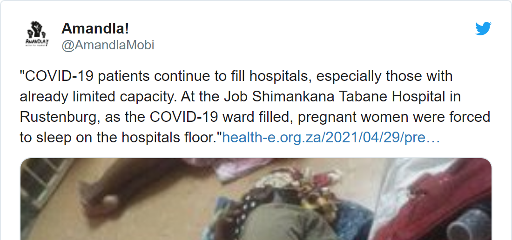
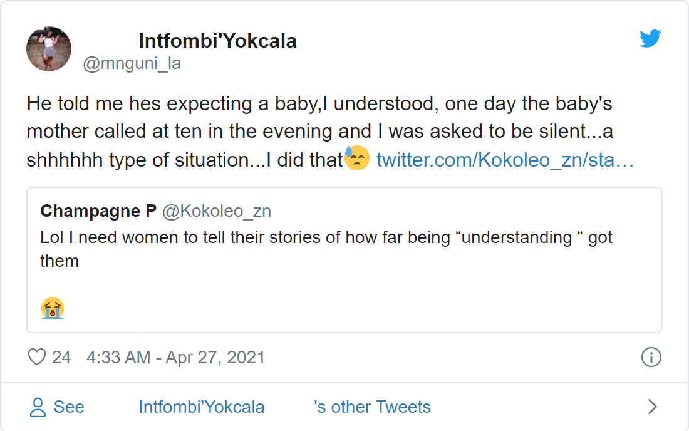

## Working with Digital Trace Data and ethics - Twitter with rtweet and Facebook

We could define digital traces as alternative sources of data ranging from social media data to web search logs. Below are some impressive examples of studies in the field of computational and digital demography.

## Pre-lecture Instruction

Please read the following research materials carefully for discussion. Participants will be required to share their key takeaway from the articles as a check-in.

-   Gupta, M., Bansal, A., Jain, B., Rochelle, J., Oak, A., & Jalali, M. S. (2021). Whether the weather will help us weather the COVID-19 pandemic: Using machine learning to measure twitter users' perceptions. International journal of medical informatics, 145, 104340. <https://doi.org/10.1016/j.ijmedinf.2020.104340>

-   Koh, J. X., & Liew, T. M. (2020). How loneliness is talked about in social media during COVID-19 pandemic: text mining of 4,492 Twitter feeds. Journal of psychiatric research. <https://doi.org/10.1016/j.jpsychires.2020.11.015>

-   Pittman, M., & Reich, B. (2016). Social media and loneliness: Why an Instagram picture may be worth more than a thousand Twitter words. Computers in Human Behavior, 62, 155-167. <https://doi.org/10.1016/j.chb.2016.03.084>

-   Lohmann, S., White, B. X., & Zhen, Z. U. O. (2018). HIV messaging on Twitter: an analysis of current practice and data-driven recommendations. AIDS (London, England), 32(18), 2799. <http://doi.org/10.1097/QAD.0000000000002018>

-   Blakemore, J. K., Bayer, A. H., Smith, M. B., & Grifo, J. A. (2020). Infertility influencers: an analysis of information and influence in the fertility webspace. Journal of assisted reproduction and genetics, 37, 1371-1378. <https://doi.org/10.1007/s10815-020-01799-2>

-   Bogen, K. W., Bleiweiss, K. K., Leach, N. R., & Orchowski, L. M. (2019). \# MeToo: Disclosure and response to sexual victimization on Twitter. Journal of interpersonal violence, 0886260519851211. <https://doi.org/10.1177%2F0886260519851211>

-   Vijaykumar, S., Nowak, G., Himelboim, I., & Jin, Y. (2018). Virtual Zika transmission after the first US case: who said what and how it spread on Twitter. American journal of infection control, 46(5), 549-557. <https://doi.org/10.1016/j.ajic.2017.10.015>

-   Stubbs-Richardson, M., Rader, N. E., & Cosby, A. G. (2018). Tweeting rape culture: Examining portrayals of victim blaming in discussions of sexual assault cases on Twitter. Feminism & Psychology, 28(1), 90-108. <https://doi.org/10.1177%2F0959353517715874>

-   Smit, A., & Bosch, T. (2020). Television and black Twitter in South Africa: Our perfect wedding. Media, Culture & Society, 42(7-8), 1512-1527. <https://doi.org/10.1177%2F0163443720926040>

From the above examples, you can observe that there has been a wide range of opportunities to answer new and exciting demographic research questions using data from digital platforms.

## Twitter Data Retreival

In today's session, we use the `rtweet` package to stream online conversations about *condom* use especially during a pandemic. We will explore the sentiments of the tweets as well as the top 10 trigrams.

As with other data analysis, remember to install the `rtweet` package and all the relevant libraries. In addition to some of the libraries that we have used in the previous sessions, we will also use some functions from the `tidytext` package

```{r}
#install.packages("rtweet")
library (rtweet)
library (tidyverse)
library (mosaic)
library (tidytext)
library (tweetrmd)
```

In order to be able to stream tweets directly from Twitter, you need to have created a Twitter account. If you don't have one, please click [here](https://twitter.com/). Please note `rtweet` should be used strictly in accordance with Twitter's [developer terms](https://developer.twitter.com/en/developer-terms/more-on-restricted-use-cases).

In the next few lines of code, we retrieve public tweets related to pregnancy during the pandemic. Reference to "during the pandemic" in part because we are in the middle of a pandemic - although much better in some regions now than before. To retrieve the tweets, we will use the `rtweet` package to download tweets within the past eight days that includes all keywords related to pregnancy e.g.: pregnant, pregnancy, expecting a baby, e.t.c.

```{r}
pregnant_keywd <- search_tweets(q = "pregnancy",
                                geocode = "-0.102613,15.933811,2238mi",
                                include_rts = FALSE, n = 5000,
                                retryonratelimit = TRUE)
```

Below are few screnshots of relevant tweets matching our keyword of interest.




We can also retrieve tweets that follow a keyphrase pattern like "expecting a baby" or "baby bump".

``` {.r}
pregnant_keyphrase <-   search_tweets(q = "\"expecting a baby\"",
                                      ## The geocode argument is specified to 
                                      ## retain only tweets from Nigeria
                                      geocode = "-0.102613,15.933811,2238mi",
                                      include_rts = FALSE,
                                      n = 5000,
                                      ## The retryonratelimit argument instructs 
                                      ## R to retry downloading the tweets after some 
                                      ## mins once the rate limit has been reached
                                      retryonratelimit = TRUE)
```

A few screnshots of relevant tweets matching our keyword of interest.




How about we merge the two datasets into one.

```{r}
merged_pregDF <- rbind(pregnant_keywd,
                        pregnant_keyphrase)
```

Save the downloaded tweets as .csv on your local computer using the `save.csv` function

```{r}

save_as_csv(merged_pregDF, "data/merged_pregDF.csv",
            prepend_ids = TRUE, na = "NA")
            
saveRDS(merged_pregDF, "data/merged_pregDF.rds")

```

## Activity

### Top Tweeters?

```{r}
tt <-   merged_pregDF %>%
        arrange(screen_name) %>%  
        group_by(screen_name) %>% 
        summarize(n = n()) %>% 
        arrange(desc(n))
```

```{r}
head(tt, 10) %>% 
ggplot(aes(x = n, y = reorder(screen_name, n), fill = screen_name)) +
geom_col() + labs(x = "Number of Tweets",
                  y = "Screen Name (UserID)",
                  title = "Top Tweeters of Pregnancy Related Keywords/Keyphrase") +
theme_bw() + theme(legend.position = "none")

ggsave(file="../images/top_tweeters.png", dpi=350, height= 6, width= 10)
```


### Influencers - Most Retweeted/Favourited?

```{r}
tt <-   merged_pregDF %>%
        arrange(screen_name) %>%  
        group_by(screen_name) %>% 
        summarize(n = n(),
                  screen_name = screen_name[1],
                  source = source[1]) %>% 
        ungroup () %>% 
        group_by (source) %>% 
        summarize (n = n()) %>% 
        arrange (desc(n))
        
```

```{r}
head(tt, 5) %>% 
ggplot(aes(x = n, y = reorder(source, n), fill = source)) +
geom_col() + labs(x = "Number of Users",
                  y = "Device Type",
                  title = "Top Tweeters of Pregnancy Related Keywords/Keyphrase") +
theme_bw() + theme(legend.position = "none")

ggsave(file="./images/top_devices.png", dpi=350, height= 6, width= 10)
```


#### Exercise 5A.1

On your own or in groups, answer the following questions:

-   Which profiles (top 10) have the highest following/friends?

-   Which profiles (top 10) have the highest followers?

-   Which profiles have the most relatively viral tweet [retweets+likes/followers]?

-   Which profiles have the highest average number of retweets+favourites?

## Text Content

```{r}
text_pregnant <-    merged_pregDF %>% 
                    select(status_id, text, screen_name) %>% 
                    unnest_tokens(trigram, text, token = "ngrams", n = 3) %>% 
                    separate(trigram, c("word1", "word2", "word3"), sep = " ") %>%  
                    
                    ## Remove common words (stopwords).
                    filter(!word1 %in% stop_words$word,       # remove stopwords 
                            !word2 %in% stop_words$word,       # remove stopwords
                            !word3 %in% stop_words$word) %>% 
                            
                    filter(!str_detect(word1, pattern = "[[:digit:]]"), # removes any words with numeric digits
                            !str_detect(word2, pattern = "[[:digit:]]"),
                            !str_detect(word3, pattern = "[[:digit:]]"),
                            
                            !str_detect(word1, pattern = "[[:punct:]]"), # removes any remaining punctuations
                            !str_detect(word2, pattern = "[[:punct:]]"),
                            !str_detect(word3, pattern = "[[:punct:]]"),
                            
                            !str_detect(word1, pattern = "(.)\\1{3,}"),  # removes any words with 3 or more repeated letters
                            !str_detect(word2, pattern = "(.)\\1{3,}"),
                            !str_detect(word3, pattern = "(.)\\1{3,}"),
                            !str_detect(word1, pattern = "\\b(.)\\b")) %>%  # removes any remaining single letter words

                       unite("trigram", c(word1, word2, word3), sep = " ") %>%
                       count(trigram, sort = TRUE)
```

## Sentiment Analysis

Sentiment analysis is the contextual mining of text in order to identify, interprete, and classify emotions with voice or text data using text analysis techniques. This opportunity allows us as researchers, and students to identify sentiments (positive, negative or neutral) towards a prevalent social problem or online conversation. For example we could be interested in the sentiments of tweets on the US immigration ban. Are they more positive, negative or neutral? In the following sections, we'll attempt to examine the sentiments of tweets on each day.

```{r}
text_immigration <-  tidy_ImmigrantBan_NG %>%
                     select(created_at, text, 
                            favorite_count, 
                            retweet_count) %>%
                     unnest_tokens("word", text) %>%
                     
                     ## Filter for words that are not in the stopwords dictionary
                     anti_join(stop_words, by = "word") %>%
                     
                     ## Filter for words that are in the sentiment dictionary and our dataframe
                     inner_join(y = sentiments, by = "word") %>% 
                     
                     ## Count the number sentiments used each day
                     count(created_at, sentiment) %>% 
                     group_by(created_at) %>% 
                     mutate (perc_nega = (n/sum(n))*100) %>% 
                     mutate (perc_nega = round (perc_nega, digits = 2),
                             sentiment = as.factor (sentiment))
```

We could also visualize the sentiment of tweets on each day using the new dataframe created above `text_immigration`.

```{r}
library(ggthemes)

    text_immigration %>% 
    ggplot (aes(x = created_at, y = perc_nega,
                fill = factor(sentiment, 
                        labels = c("Negative",
                                    "Positive")))) +
    geom_bar (stat = "identity") + 
    theme_fivethirtyeight () +
    labs (title = "Sentiment of Tweets Related to US Immigration Ban") +
    guides(fill=guide_legend(title="Sentiment of Tweets")) +
    scale_fill_manual(values = c("#ffb612", "#000000"))
```

## What Next

**The Summer Institute for Computational Social Science**

The Summer Institute for Computational Social Science [SICSS] is currently accepting applications (until March 20) for this years summer school. The institute brings together graduate students, postdoctoral researchers, and junior faculty for 2 weeks of intensive study and interdisciplinary research. This year there are more than 20 partner locations. Feel free to review the application requirements and apply to attend the location nearest to you. [**Apply Now**](https://compsocialscience.github.io/summer-institute/2020/stellenbosch/)

**The Barcelona Summer School of Demography**

The Barcelona Summer School of Demography [BSSD] is also accepting applications (until March 31) for participation at this years summer school. The BSSD is based at the Centre for Demographic Studies (CED), Universitat Autònoma de Barcelona, and offers a four-week intensive course in R covering three major strengths of R: statistical and demographic analysis, data visualization, and spatial analysis. Participants are free to apply for the entire course or any of the individual modules. [**Apply Now**](https://ced.uab.cat/en/courses/barcelona-summer-school-of-demography/)

## Supplemental Readings

-   Alburez-Gutierrez, D., Aref, S., Gil-Clavel, B. S., Grow, A., Negraia, D. V., Zagheni, E. In: Arbia, G., Peluso, S., Pini, A., Rivellini, G. (Eds.): Smart statistics for smart applications : book of short papers SIS2019, 23--30 Pearson (2019) <https://osf.io/preprints/socarxiv/24jp7/>

-   Cesare, N., Lee, H., McCormick, T., Spiro, E., & Zagheni, E. (2018). "Promises and pitfalls of using digital traces for demographic research." Demography. 55(5), 1979-1999. <https://doi.org/10.1007/s13524-018-0715-2>

-   Pham, Katherine Hoffmann, Francesco Rampazzo, and Leah R. Rosenzweig. (2019). "Online Surveys and Digital Demography in the Developing World: Facebook Users in Kenya." arXiv preprint arXiv:[1910.03448](https://arxiv.org/abs/1910.03448).

-   Salganik, Matthew J. (2017). Bit by Bit: Social Research in the Digital Age. Princeton, NJ: Princeton University Press. Open review edition. <https://www.bitbybitbook.com/en/1st-ed/preface/>
