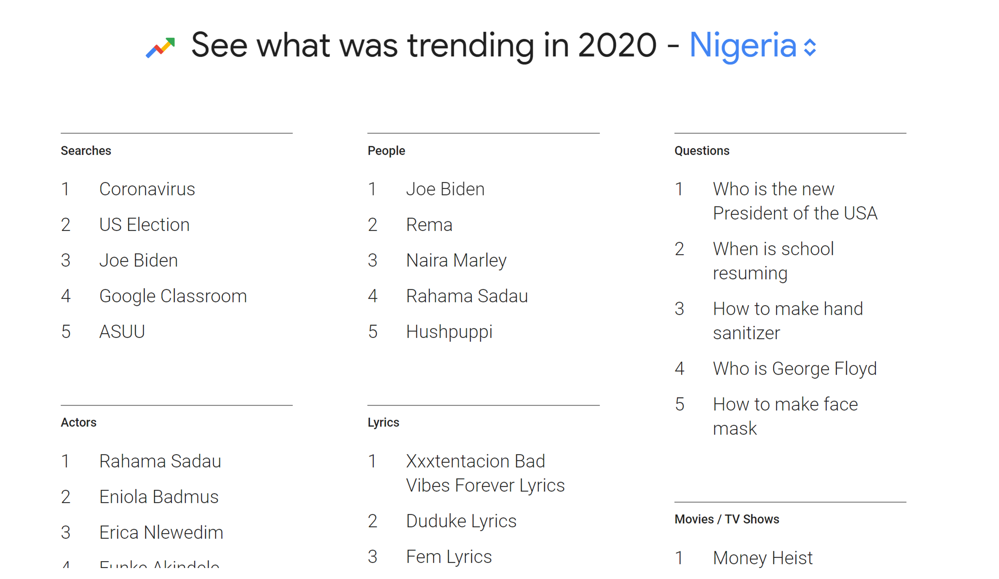

## Working with Digital Trace Data and ethics - Twitter with rtweet and Facebook

Yesterday, we examined the use of Twitter data to characterize tweeting
behaviours as well as emotions in the Tweets. Today, we will use web
search data (Google search trends), to evaluate changes in interest in a
social issue or topic. Simply put, Google Trends tells us what people
are searching for, in real time. We can use this data to measure search
interest in a particular topic, in a particular place, and at a
particular time. GoogleTrends data for example now offers researchers
the opportunity to answer new and exciting demographic/social science
research questions. In one recent study, we examined the timing of
intense search activity uncover intricate patterns of health information
seeking during the pandemic in most of the countreis sampled. We
observed that surge in the search interest for coronavirus symptoms in
several African countries followed national case trends and usually
occurred after a national announcement of an outbreak rather than global
trends.


## Objective

This is an applied session, leveraging the skills you have learned from
the previous days to analyzing search trends data from Google. By the
end of this session, you should be able to:

-   retrieve data from Google Trends

-   conduct basic analysis of googleTrends search data.

-   visualize patterns of search interest for multiple
    countries/keywords over a period.

-   interpreat the results/values obtained from GoogleTrends.

-   formulate interesting research questions answerable using Gdata from
    Twitter.

## GoogleTrends Data Retrieval

As mentioned previously, we can obtain a record of individual’s activity
from digital platforms to make inferences about their attitudes,
knowledge and/or behaviour. Twitter is an exciting source of data on
social attitudes because it facilitates discussions about a wide range
of social and personal issues. As you may have observed from the
pre-lecture readings, data obtained from Twitter can be used to
understand loneliness, suicide ideation, perception about
COVID19/gender-based violence/police brutality. The screenshot below
highlights the kind and amount of information available from a single
tweet by an individual.


We will use the `gtrendsR` package to retrieve search interests for
specific keywords but directly into Rstudio for further analysis in
today’s session. We will analyze interest in vaccination for a few
African countries over a period of time. We could also compare the
observed trends with interest in Crypto currencies in the selected
countries. As indicated in the [pre-lecture
instructions](https://github.com/eolamijuwon/IEMeSSR/blob/main/Lectures/README.md#day-4-thursday-may-13-2021),
please install the relevant packages before you proceed to load the
libraries.

``` r
#install.packages("rtweet")
library (tidyverse)
library (gtrendsR)
library (lubridate)
```

***If you have any questions, please do not hesitate to contact me.***
