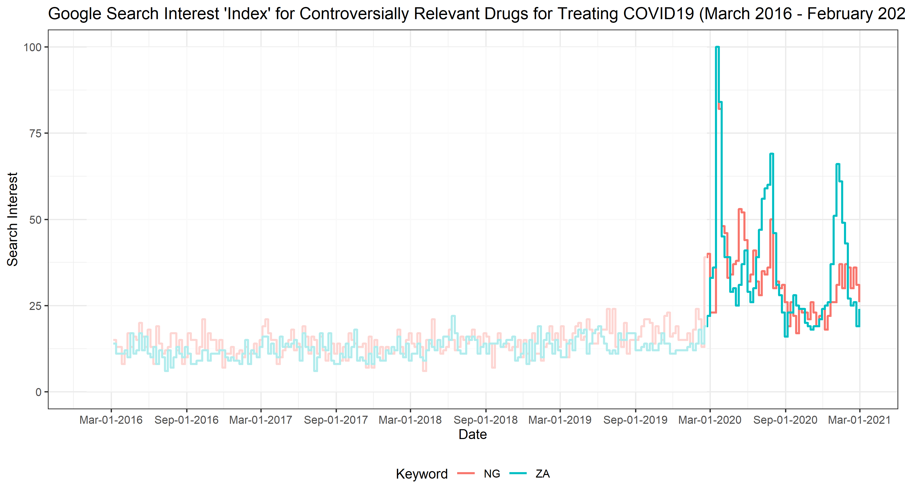

## Working with Digital Trace Data and ethics - Google Trends

Yesterday, we examined the use of Twitter data to characterize tweeting
behaviours and emotions in the Tweets. Today, we will use web search
data (Google search trends) to evaluate changes in interest in a social
issue or topic.

Google Trends analyzes a subset of web searches on Google to determine
how many searches were done over a certain period. Simply put, Google
Trends tells us what people are searching for in real-time. We can use
this data to measure search interest in a particular topic, in a
particular place, and over a period. Additional information about
GoogleTrends and how to interpret the data can be accessed via the
[Trends Help Centre](https://web.facebook.com/business/ads)

GoogleTrends data, as a result, now offers researchers the opportunity
to answer new and exciting demographic/social science research
questions. In one recent study, we examined the timing of intense search
activity uncovers intricate patterns of health information seeking
during the pandemic in most of the countries sampled. We observed that a
surge in the search interest for coronavirus symptoms in several African
countries followed national case trends and usually occurred after a
national announcement of an outbreak rather than global trends.


## Objective

This is an applied session, leveraging the skills you have learned from
the previous days to analyzing search trends data from Google. We will
also briefly examine the principles of quasi-random online surveys using
Facebook. By the end of this session, you should be able to:

-   retrieve data from Google Trends

-   conduct basic analysis of GoogleTrends search data.

-   visualize patterns of search interest for multiple
    countries/keywords over a period.

-   interpret the results/values obtained from GoogleTrends.

-   formulate interesting research questions answerable using
    GoogleTrends data.

-   implement quasi-random surveys using [Facebook’s advertising
    platform](https://web.facebook.com/business/help/714656935225188?id=802745156580214&_rdc=1&_rdr).

## GoogleTrends Data Retrieval

As mentioned previously, we can obtain an aggregated search interest for
*online users* in a country or region from GoogleTrends. Google is an
exciting source of data on search interest primarily because it is the
most used search engine in many countries, including those in the
developing regions. As a result, they also offer an opportunity to get
insights into the patterns of information demand. The screenshot below
highlights the kind of information available via GoogleTrends.


We will use the `gtrendsR` package to retrieve search interests for
specific keywords but directly into Rstudio for further analysis in
today’s session. We will analyze interest in vaccination in two African
countries \[South Africa-ZA, Nigeria-NG\] over a period. We will also
compare the observed trends for the *vaccine keyword* with search
interest for bitcoin in the same countries during the same period. As
indicated in the [pre-lecture
instructions](https://github.com/eolamijuwon/IEMeSSR/blob/main/Lectures/README.md#day-4-thursday-may-13-2021),
please install the relevant packages before you proceed to load the
libraries.

``` r
library (tidyverse)   ## Data wrangling/management
library (gtrendsR)    ## Retrieving google trends data
library (lubridate)   ## Working with dates
library(scales)       ## Adjusting/Formatting scales/axis in graphs.
```

In the following few lines of code, we will retrieve data on search
interest for vaccine and bitcoin. Precisely, we want to understand how
often people are interested in vaccination compared to bitcoin and when
such demand for information is intense/highest since 2020. We will focus
on data from Nigeria and South Africa since these countries have the
highest internet penetration in Africa - search activity may more
closely reflect the offline interest in these countries – but we also
expect that bitcoins will be probably only fascinating to those with
internet access.

``` r
  time=("2020-01-01 2021-03-30")
  trends_ZA <- gtrends(c("vaccine", "bitcoin"),
                          gprop = "web",
                          geo = c("ZA"),
                          time = time,
                          onlyInterest = TRUE)
  
  trends_ZA <- trends_ZA$interest_over_time
```

Please note that for both countries, we specified the same keywords and
the same period/time. Any alteration to the input parameters will affect
the comparability of the search results.

``` r
  time=("2020-01-01 2021-03-30")
  trends_NG <- gtrends(c("vaccine", "bitcoin"),
                          gprop = "web",
                          geo = c("NG"),
                          time = time,
                          onlyInterest = TRUE)
  
  trends_NG <- trends_NG$interest_over_time
```

In the following lines of code, we will create one database of search
interest for vaccine and bitcoin in the last year by combining the data
from the two countries.

``` r
trends_search <- rbind(trends_NG, trends_ZA)
```

You can use either `View()` or `head()` to get an idea of the downloaded
data for the two countries.

``` r
head(filter(trends_search, geo == "NG"), 10)
```

    ##          date hits keyword geo                  time gprop category
    ## 1  2020-01-05    3 vaccine  NG 2020-01-01 2021-03-30   web        0
    ## 2  2020-01-12    4 vaccine  NG 2020-01-01 2021-03-30   web        0
    ## 3  2020-01-19    4 vaccine  NG 2020-01-01 2021-03-30   web        0
    ## 4  2020-01-26    5 vaccine  NG 2020-01-01 2021-03-30   web        0
    ## 5  2020-02-02    5 vaccine  NG 2020-01-01 2021-03-30   web        0
    ## 6  2020-02-09    5 vaccine  NG 2020-01-01 2021-03-30   web        0
    ## 7  2020-02-16    5 vaccine  NG 2020-01-01 2021-03-30   web        0
    ## 8  2020-02-23    6 vaccine  NG 2020-01-01 2021-03-30   web        0
    ## 9  2020-03-01    8 vaccine  NG 2020-01-01 2021-03-30   web        0
    ## 10 2020-03-08   10 vaccine  NG 2020-01-01 2021-03-30   web        0

``` r
head(filter(trends_search, geo == "ZA"), 10)
```

    ##          date hits keyword geo                  time gprop category
    ## 1  2020-01-05    2 vaccine  ZA 2020-01-01 2021-03-30   web        0
    ## 2  2020-01-12    3 vaccine  ZA 2020-01-01 2021-03-30   web        0
    ## 3  2020-01-19    3 vaccine  ZA 2020-01-01 2021-03-30   web        0
    ## 4  2020-01-26    7 vaccine  ZA 2020-01-01 2021-03-30   web        0
    ## 5  2020-02-02    8 vaccine  ZA 2020-01-01 2021-03-30   web        0
    ## 6  2020-02-09    6 vaccine  ZA 2020-01-01 2021-03-30   web        0
    ## 7  2020-02-16    5 vaccine  ZA 2020-01-01 2021-03-30   web        0
    ## 8  2020-02-23    7 vaccine  ZA 2020-01-01 2021-03-30   web        0
    ## 9  2020-03-01   11 vaccine  ZA 2020-01-01 2021-03-30   web        0
    ## 10 2020-03-08   23 vaccine  ZA 2020-01-01 2021-03-30   web        0

You can also get a glimpse of the dataset using the `glimpse()`
function.

``` r
glimpse(trends_search)
```

    ## Rows: 260
    ## Columns: 7
    ## $ date     <dttm> 2020-01-05, 2020-01-12, 2020-01-19, 2020-01-26, 2020-02-02, ~
    ## $ hits     <int> 3, 4, 4, 5, 5, 5, 5, 6, 8, 10, 32, 59, 36, 22, 19, 29, 31, 24~
    ## $ keyword  <chr> "vaccine", "vaccine", "vaccine", "vaccine", "vaccine", "vacci~
    ## $ geo      <chr> "NG", "NG", "NG", "NG", "NG", "NG", "NG", "NG", "NG", "NG", "~
    ## $ time     <chr> "2020-01-01 2021-03-30", "2020-01-01 2021-03-30", "2020-01-01~
    ## $ gprop    <chr> "web", "web", "web", "web", "web", "web", "web", "web", "web"~
    ## $ category <int> 0, 0, 0, 0, 0, 0, 0, 0, 0, 0, 0, 0, 0, 0, 0, 0, 0, 0, 0, 0, 0~

From above, we see that our dataset has 260 rows and 7 columns. Among
the rows are:

-   date: in this example, the dates are presented in weeks. That is
    search interest for the week.

-   hits: the level of search interest for the specific keyword on a
    date\[or week\].

-   keyword: the keyword column. Remember that we have two keywords.
    This column will tell you which keyword has what level of search
    interest for a country and a date.

-   geo: contains information about the country or geographic location.
    This is an important column for this analysis since we are working
    with search interest for two countries.

Others are time, gprop, and category. In the next lines of code, we will
subset our data and retain only the relevant columns using `select()`.

``` r
search_Trends <-  trends_search %>% 
                  select(date, keyword, geo, hits) %>% 
                  mutate (date = as.Date(date))
```

We can visualize patterns in the search interest using a line graph. The
[The R Graph Gallery](https://www.r-graph-gallery.com/) has many
excellent resources for getting started with data visualization in R or
choosing the right graph for your data. In the following code block, we
will combine a few functions to create a fancy line graph showing the
patterns of search interest for bitcoin and vaccine in South Africa and
Nigeria. For ease of interpretation, we will shade the area of the graph
when Coronavirus had not gained global international interest.

-   `ggplot()` - plotting

-   `geom_step()` - add a layer of line/step graph.

-   `labs()` - add labels to your graph \[could be axis labels, plot
    title, subtitle, caption or legend title\].

-   `annotate()` - add a layer to the graph \[could be a rectangular
    layer or line or text\]

-   `facet_wrap()` - creating multi-panel plots.

``` r
search_Trends %>% 
  ggplot(aes(x = date, 
             y = hits,
             group = keyword,
             color = keyword)) +
  geom_step(size = 0.8) +
  annotate("rect", xmin = date("2020-01-01"),
            xmax = date("2020-12-01"),
            ymin = 0, ymax = 100,
            fill = "white",
            alpha = 0.7) +
  annotate("segment", x = date("2020-12-01"),
            xend = date("2020-12-01"),
            y = 0, yend = 100,
            color = "orange",
           size = 1.1) +
  facet_wrap(~geo) +
  scale_x_date(date_labels = "%b-%d-%Y",
               breaks = scales::date_breaks(width = "3 month")) +
  theme_bw() + theme(legend.position = "bottom") +
  labs (x = "Date", y = "Search Interest",
        color = "Keyword",
        title = "Google Search Interest for Bitcoin and Vaccine in Nigeria and South Africa (March 2016 - February 2021).")
```

``` r
ggsave(file="../images/searchInt_covid.png", dpi=350, height= 4.5, width= 10)
```


***Note:*** Your interpretation of the results should be based on
patterns of search interest *within* a country ***during a period.*** As
shown in the figure above, search interest for vaccines was slightly
high in March 2020, although higher in South Africa than Nigeria during
the same period. Search interest for bitcoin also reached its peak in
the two countries at about the same time. Vast differences were observed
in the search interest for bitcoin and vaccine in Nigeria but not South
Africa. Online users in Nigeria seemed to more interested in bitcoin
than vaccines, while no significant difference in search interest was
observed between bitcoin and vaccine in South Africa.

We might also be interested in search interest for some of the most
frequently discussed medications for treating Coronavirus. Many of these
drugs are not new. For example, chloroquine has been in use in Nigeria
for treating malaria even long before COVID-19. Vitamin C is also a
popular supplement but has search interest for these drugs increased
significantly during the COVID-19 pandemic and which drug has attracted
the most attention in South Africa and Nigeria? For this, we will
retrieve search interest data for *azithromycin*, *chloroquine*,
*vitamin c*, *zinc*, as we did in the previous exercise.

``` r
  time=("2016-03-01 2021-02-28")
  trends_NG <- gtrends(c("azithromycin", "chloroquine",
                            "vitamin c", "zinc"),
                          gprop = "web",
                          geo = c("NG"),
                          time = time,
                          onlyInterest = TRUE)
  
  trendsMed_NG <- trends_NG$interest_over_time
```

``` r
  time=("2016-03-01 2021-02-28")
  trends_ZA <- gtrends(c("azithromycin", "chloroquine",
                            "vitamin c", "zinc"),
                          gprop = "web",
                          geo = c("ZA"),
                          time = time,
                          onlyInterest = TRUE)
  
  trendsMed_ZA <- trends_ZA$interest_over_time
```

We can also combine the two datasets to create one database of search
interest for COVID19 controversially “relevant” drugs as we did in the
previous exercise.

``` r
trendsMed_search <- rbind(trendsMed_NG,
                       trendsMed_ZA) %>% 
                    mutate (date = as.Date(date))
```

``` r
trendsMed_search %>% 
  ggplot(aes(x = date, 
             y = hits,
             group = keyword,
             color = keyword)) +
  geom_step(size = 0.8) +
  annotate("rect", xmin = date("2016-01-01"),
            xmax = date("2020-02-22"),
            ymin = 0, ymax = 100,
            fill = "white",
            alpha = 0.7) +
  facet_wrap(~geo) +
  scale_x_date(date_labels = "%b-%d-%Y",
               breaks = scales::date_breaks(width = "12 month")) +
  theme_bw() + theme(legend.position = "bottom") +
  labs (x = "Date", y = "Search Interest",
        color = "Keyword",
        title = "Google Search Interest for Controversially Relevant Drugs for Treating COVID19 by Country (March 2016 - February 2021).")
```

``` r
ggsave(file="../images/searchIntMed_covid.png", dpi=350, height= 5, width= 12)
```


As shown in the figure above, search interest for most of the drugs
reached its peak after a case of COVID19 had been confirmed in an
African country \[Nigeria - Feb 22, 2020\]. Among the drugs, search
interest was generally high for chloroquine in Nigeria, while search
interest for vitamin C was higher than other drugs in South Africa.
Search interest for azithromycin and chloroquine reached their lowest in
both countries by August. About the same time, search interests for
vitamin C and Zinc were slightly high (about 25/100). Overall, it
appears that the emergence of COVID19 increase public awareness or
interest in chloroquine (in Nigeria) and Vitamin C (in South Africa).

We can also create a composite index for the drugs for each country.

``` r
trendsMed_grouped <-  trendsMed_search %>% 
                      group_by(geo, date) %>% 
                      summarise(hits = sum(hits)) %>% 
                      ungroup()
```

    ## `summarise()` has grouped output by 'geo'. You can override using the `.groups` argument.

Now that we have created a cumulative sum of search interest for all the
drugs, we may have values as high as 200 or even 400 based on search
hits for azithromycin + search hits for chloroquine + search hits for
vitamin C + search hits for zinc. It might be interesting to rescale our
values to 100 so that the highest cumulative search interest on a day is
now 100 and the lowest is 0.

``` r
trendsMed_grouped <-  trendsMed_grouped %>% 
                      group_by(geo) %>% 
                      mutate (hits = hits/max(hits)*100) %>% 
                      mutate (hits = round(hits, 0))
```

``` r
trendsMed_grouped %>% 
  ggplot(aes(x = date, 
             y = hits,
             group = geo,
             color = geo)) +
  geom_step(size = 0.8) +
  annotate("rect", xmin = date("2016-01-01"),
            xmax = date("2020-02-22"),
            ymin = 0, ymax = 100,
            fill = "white",
            alpha = 0.7) +
  scale_x_date(date_labels = "%b-%d-%Y",
               breaks = scales::date_breaks(width = "6 month")) +
  theme_bw() + theme(legend.position = "bottom") +
  labs (x = "Date", y = "Search Interest",
        color = "Keyword",
        title = "Google Search Interest 'Index' for Controversially Relevant Drugs for Treating COVID19 (March 2016 - February 2021).")
```

``` r
ggsave(file="../images/GrpSearchMed_covid.png", dpi=350, height= 5.5, width= 10)
```



The figure above shows the magnitude of search interest for all the
controversially relevant drugs for treating COVID-19 in Nigeria and
South Africa in the last five years. As shown in the figure, the
composite index for all the controversially relevant drugs for treating
COVID-19 reached its peak in both countries in the same month - after a
case had been identified in Africa. Simultaneously, the patterns of
search interest was almost similar in both countries except for moderate
peaks in the composite search interest in South Africa in August 2020
and February 2021. It appeared that the overall interest in the
controversially relevant keywords increased rapidly after the
coronavirus outbreak.

## Working with Digital Trace Data and ethics - Online Surveys via Facebook

Facebook’s advertising platform provides not only a recruitment tool but
also a sampling frame—especially since no sampling frame of young
African adults with access to the internet exists (Schneider & Harknett,
2019). From the platform, we can place advertisements that targets
individuals in different sociodemographic and economic groups including
by gender, age, education, “migrant” status, interest among several
others. Multiple studies today have shown that advertisements placed on
Facebook are cost effective and efficient in reaching large audiences
include those who are hard-to-reach. In African populations, the
increasing popularity of Facebook especially among Young African adults
makes it a valuable resource for recruiting a quasi-random survey.
Please see Olamijuwon, E. O. (2021). Characterizing low effort
responding among young African adults recruited via Facebook
advertising. *Plos One*. [doi:
10.1371/journal.pone.0250303](https://doi.org/10.1371/journal.pone.0250303)


## Summary

Thus far, we have covered how to retrieve search interest data from
Google Trends. We also attempted to analyze, visualize and interpret our
findings. Like the methods of analyzing Twitter data, many of the
approaches used in today’s activities can easily be applied to different
contexts such as:

-   the effect of the pandemic on demographically relevant
    characteristics like birth, marriages, divorce and others.

-   search interest in two different social issues and several others.

Lastly, we have also briefly explored opportunities for recruiting a
quasi-random sample using Facebook advertising platform. There are also
several other platforms from which information about
individuals/groups/communities can be retrieved online, include
[AirBNB](http://insideairbnb.com/get-the-data.html), traffic data from
[Google Maps](https://www.google.com/maps). I recently wrote a
\[tutorial\]
(<https://e.olamijuwon.com/how-to-magickally-visualize-historical-google-maps-traffic-data/>)
about how to visualize historical Google Maps traffic data during the
outbreak of the coronavirus.

I also publish tutoRials on my [blog](http://e.olamijuwon.com/blog/) and
you might find the [R bloggers](https://www.r-bloggers.com/) or [stack
overflow](https://stackoverflow.com/questions) relevant.

## Limitations/Ethics of Twitter Data

-   Data collection purpose: Digital traces are typically not initially
    collected for research purposes. As a result, many aspects of the
    data needs to be clarified. Some keywords may return a 0 value which
    means search activity for the keyword was low during the period.

-   Generalizability: The findings from the analysis of GoogleTrends may
    not be inferred to the general population but only to a subset of
    the population with access to the internet. Also worth noting that
    search interest may be influenced by other trending social issues
    and may not correlate with the actual behaviour of the one seeking
    information. For example, search interest for divorce is likely to
    peak during this period (May 2021), not necessarily due to COVID or
    that people are interested in dissolving their union but perhaps
    seeking information about the Gates Divorce.

-   Duplicates: Google reports that it deletes multiple searches by a
    user, but we are not fully aware of when that happens. If it takes
    6months to delete multiple searches from a device, search interest
    for a keyword in the past six months may likely have been
    over-estimated.

***If you have any questions, please do not hesitate to contact me.***
