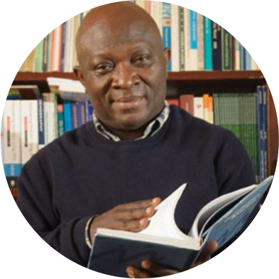
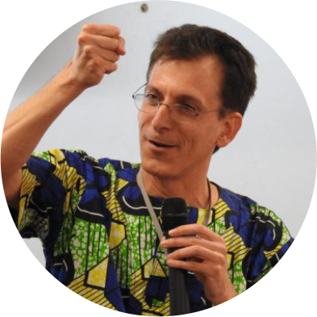
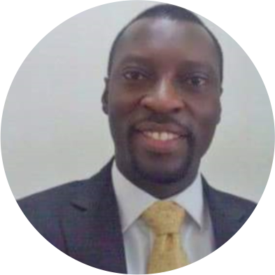
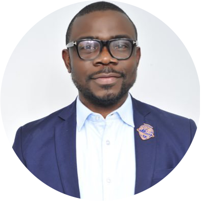
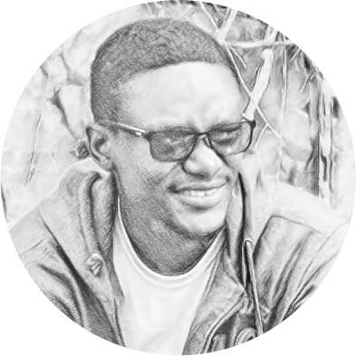

# Introduction

There is an increasing amount of data on every aspect of human activities, thus creating an unprecedented potential to address longstanding social science research questions. However, data analysis from these and several other sources requires both scalable computational tools and an understanding of how the substantive scientific questions should drive the data analysis. This introductory workshop on emerging methodologies in social science research will provide social scientists with the opportunity to develop the tools necessary to uncover new and relevant insights.

The workshop will be divided into three different sections covering five days of tutorials and activities. In the first days, we explore an introduction to coding in social sciences with a special focus on data wrangling and analysis using R. In the second category, we retrieve data from digital footprints, especially those generated by existing platforms like Twitter, Facebook, GoogleTrends and others. In the last category, we explore reproducible analysis using R Studio.

Subsequently, the workshop will cover the use of R for basic demographic methods and a demo on the emerging field of computation and digital demography. As you may have already known, R is a **powerful**, cross-platform, open-source, and **free** software that has been widely adopted across a number of [social]science fields. The session will focus on laying a groundwork to enable future self-teaching of specific use cases *[models, packages, analysis]*. A number of platforms provide *free* training resources for learning R online. This includes but not limited to [*edX*](https://www.edx.org/), [*Cousera*](https://www.coursera.org/), [*Udacity*](https://www.udacity.com/), and of course [*YouTube*](https://www.youtube.com/),

For the session, you will be required to have R and Rstudio installed on your computer. If you are still to download/install R, please [[click here](https://cloud.r-project.org/)] or [[here](https://rstudio.com/products/rstudio/download/)] to download RStudio

# :chart_with_upwards_trend: **Organization**

### Day 1: Monday, May 10, 2021

-   10:00 – 11:00 SAST: Introduction to Emerging Methodologies *[Prof Odimegwu, C.]*

-   15:00 – 17:00 SAST: Introduction to Data Wrangling with R *[Prof Alence, R.]*

### Day 2: Tuesday, May 11, 2021

-   15:00 – 17:00 SAST: Introduction to Data Analysis with R *[Prof Alence, R.]*

### Day 3: Wednesday, May 12, 2021

-   15:00 – 17:00 SAST: [Working with Digital Trace Data and ethics - Twitter](https://github.com/eolamijuwon/IEMeSSR/blob/main/Lectures/Day%203%20-%20DigitalTrace%20Twitter%20data.md) *with* [`rtweet`](https://github.com/ropensci/rtweet) *[Olamijuwon, E.]*

### Day 4: Thursday, May 13, 2021

-   15:00 – 17:00 SAST: Working with Digital Trace Data and ethics – GoogleTrends *with* [`gtrendsR`](https://github.com/PMassicotte/gtrendsR), and Online Surveys. *[Olamijuwon, E.]*

### Day 5: Friday, May 14, 2021

-   15:00 – 17:00 SAST: Reproducible Analysis and Machine Learning with R/R-Studio *[Dr Ogbuokiri, B.]*

There are a few pre-lecture instructions for you. You can access them [here](/Lectures/README.md). Please go study them carefully ahead of the lectures since there will not be anytime to go over them again during the tutorials. Please do not hesitate to contact us if you have any questions or need help.

# :family_man_man_boy: **Team**

-   [**Prof. Clifford Odimegwu**](https://orcid.org/0000-0002-6273-8807) is a professor of demography, social statistics, and population health, and founding director of the Graduate Programme in Demography and Population Studies, at the University of the Witwatersrand, Johannesburg, South Africa. His expertise covers the field of technical demography, population health, public health, sociology, and social statistics. -[\@CliffOdimegwu](https://twitter.com/CliffOdimegwu)

-   [**Prof Rod Alence**](https://www.wits.ac.za/staff/academic-a-z-listing/a/rodalencewitsacza/) is an associate professor in the Department of International Relations at the University of the Witwatersrand. His main interests are in the areas of political economy, African development, and quantitative research methods. is an associate professor in the Department of International Relations at the University of the Witwatersrand. His main interests are in the areas of political economy, African development, and quantitative research methods.

-   [**Dr. Adewoyin**](https://www.wits.ac.za/staff/academic-a-z-listing/a/adeyemiadewoyinwitsacza/) is a lecturer and research scientist in the Department of Geography, University of Nigeria (UNN). He is also a Postdoctoral Fellow at the Demography and Population Studies Programme, University of the Witwatersrand, South Africa. He combines his eclectic academic and professional backgrounds in teaching and researching the health and political dimensions of regional development. -[\@yemiadewoyin](https://twitter.com/yemiadewoyin)

-   [**Dr. Blessing Ogbuokiri**](https://scholar.google.com/citations?user=JZ_wxE4AAAAJ&hl=en) is a lecturer in the department of Computer Science at the University of Nigeria, Nsukka. He is also a visiting lecturer in the Department of Applied Information Systems, School of Consumer Intelligence & Information Systems (SCiiS), University of Johannesburg, South Africa. He has over fifteen years of work experience in academia, the software, and IT industries. His core research interest are in theoretical computing, machine learning, deep learning for social good, computer vision, software engineering (emphasis on implementation and testing). -[\@BlessingManB](https://twitter.com/BlessingManB)

-   [**Emmanuel Olamijuwon**](https://e.olamijuwon.com/) is a research fellow at the University of St. Andrews, United Kingdom and a doctoral candidate at the University of the Witwatersrand in South Africa. His primary research examines the opportunities to illuminate health challenges and health outcomes in African populations using data from online platforms. -[\@eolamijuwon](https://twitter.com/eolamijuwon)

# :family_man_man_boy: **Questions?**

If you are an attendee and you need clarity on any aspect of the tutorial, please contact your instructor directly.
