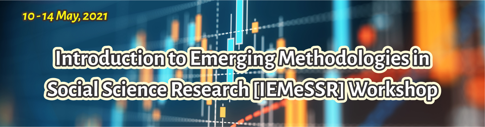

# Introduction

There is an increasing amount of data on every aspect of human activities, thus creating an unprecedented potential to address longstanding social science research questions. However, data analysis from these and several other sources requires both scalable computational tools and an understanding of how the substantive scientific questions should drive the data analysis. This introductory workshop on emerging methodologies in social science research will provide social scientists with the opportunity to develop the tools necessary to uncover new and relevant insights.

The workshop will be divided into three different sections covering five days of tutorials and activities. In the first days, we explore an introduction to coding in social sciences with a special focus on data wrangling and analysis using R. In the second category, we retrieve data from digital footprints, especially those generated by existing platforms like Twitter, Facebook, GoogleTrends and others. In the last category, we explore reproducible analysis using R Studio.

Subsequently, the workshop will cover the use of R for basic demographic methods and a demo on the emerging field of computation and digital demography. As you may have already known, R is a **powerful**, cross-platform, open-source, and **free** software that has been widely adopted across a number of [social]science fields. The session will focus on laying a groundwork to enable future self-teaching of specific use cases *[models, packages, analysis]*. A number of platforms provide *free* training resources for learning R online. This includes but not limited to [*edX*](https://www.edx.org/), [*Cousera*](https://www.coursera.org/), [*Udacity*](https://www.udacity.com/), and of course [*YouTube*](https://www.youtube.com/),

For the session, you will be required to have R and Rstudio installed on your computer. If you are still to download/install R, please [[click here](https://cloud.r-project.org/)] or [[here](https://rstudio.com/products/rstudio/download/)] to download RStudio

# :chart_with_upwards_trend: **Organization**

### Day 1: Monday, May 10, 2021

-   10:00 – 11:00 SAST: Introduction to Emerging Methodologies *[Prof Odimegwu, C.]*

-   15:00 – 17:00 SAST: Introduction to Data Wrangling with R *[Prof Alence, R.]*

### Day 2: Tuesday, May 11, 2021

-   15:00 – 17:00 SAST: Introduction to Data Analysis with R *[Prof Alence, R.]*

### Day 3: Wednesday, May 12, 2021

-   15:00 – 17:00 SAST: Working with Digital Trace Data and ethics - Twitter *with* [`rtweet`](https://github.com/ropensci/rtweet) and Facebook *[Olamijuwon, E.]*

### Day 4: Thursday, May 13, 2021

-   15:00 – 17:00 SAST: Working with Digital Trace Data and ethics – GoogleTrends *with* [`gtrendsR`](https://github.com/PMassicotte/gtrendsR), and Online Surveys. *[Olamijuwon, E.]*

### Day 5: Friday, May 14, 2021

-   15:00 – 17:00 SAST: Reproducible Analysis in R Studio *[Dr Ogbuokiri, B.]*

# :family_man_man_boy: **Team**

-   [**Prof. Clifford Odimegwu**](https://orcid.org/0000-0002-6273-8807) [\@CliffOdimegwu](https://twitter.com/CliffOdimegwu) is a professor of Demography at the University of the WItwatersrand, South Africa.

-   [**Dr. Adewoyin**](https://www.wits.ac.za/staff/academic-a-z-listing/a/adeyemiadewoyinwitsacza/).

-   [**Prof Rod Alence**](https://www.wits.ac.za/staff/academic-a-z-listing/a/rodalencewitsacza/)is an associate professor in the Department of International Relations at the University of the Witwatersrand. His main interests are in the areas of political economy, African development, and quantitative research methods.

-   [**Dr. Blessing Ogbuokiri**](https://scholar.google.com/citations?user=JZ_wxE4AAAAJ&hl=en) [\@BlessingManB](https://twitter.com/CliffOdimegwu)

-   [**Emmanuel Olamijuwon**](https://e.olamijuwon.com/) [\@eolamijuwon](https://twitter.com/eolamijuwon) is a research fellow at the University of St. Andrews, United Kingdom and a doctoral candidate at the University of the Witwatersrand in South Africa. His primary research examines the opportunities to illuminate health challenges and health outcomes in African populations using data from online platforms.

# :family_man_man_boy: **Questions?**

If you are an attendee and you need clarity on any aspect of the tutorial, please contact your instructor directly.
